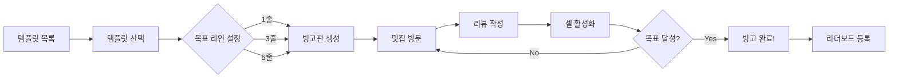
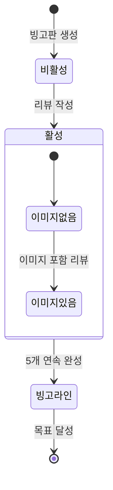
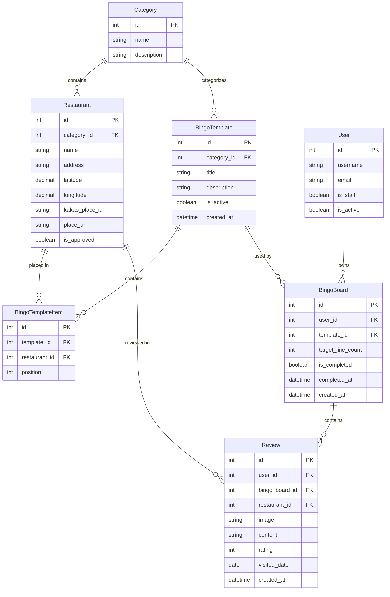

# Product Requirements Document (PRD)

## Delicious Bingo - 맛집 도장깨기 빙고

> 맛집 탐방을 게임화한 5x5 빙고 웹 애플리케이션

---

## 1. 제품 개요

| 항목 | 내용 |
|------|------|
| **제품명** | Delicious Bingo (맛집 도장깨기 빙고) |
| **컨셉** | 5x5 빙고판의 맛집을 방문하고 리뷰를 작성하여 빙고를 완성하는 게임 |
| **핵심 가치** | 맛집 탐방의 게임화, 성취감, 커뮤니티 기반 맛집 발견 |
| **타겟 사용자** | 맛집 탐방을 즐기는 푸드 애호가 |
| **플랫폼** | 모바일 웹 (반응형) |

### 배포 URL
- **Frontend**: https://delicious-bingo.vercel.app
- **Backend API**: https://delicious-bingo-production.up.railway.app

---

## 2. 기술 스택

### Backend
| 기술 | 버전 | 용도 |
|------|------|------|
| Python | 3.12 | 런타임 |
| Django | 6.0.1 | 웹 프레임워크 |
| Django REST Framework | 3.16 | REST API |
| PostgreSQL | - | 데이터베이스 (Railway) |
| Gunicorn | - | WSGI 서버 |
| WhiteNoise | - | 정적 파일 서빙 |
| Cloudinary | - | 이미지 클라우드 저장소 |

### Frontend
| 기술 | 버전 | 용도 |
|------|------|------|
| React | 19 | UI 라이브러리 |
| Vite | 7 | 빌드 도구 |
| Tailwind CSS | 4 | 스타일링 |
| React Router | 7 | 라우팅 |
| TanStack Query | 5 | 서버 상태 관리 |
| Axios | - | HTTP 클라이언트 |
| Vitest | - | 유닛 테스트 |
| Playwright | - | E2E 테스트 |

### 인프라
| 서비스 | 용도 |
|--------|------|
| Railway | Backend 호스팅, PostgreSQL |
| Vercel | Frontend 호스팅 |
| Cloudinary | 이미지 CDN |
| Kakao Maps API | 지도 서비스 |

---

## 3. 핵심 기능

### 3.1. 빙고 게임플레이

#### 게임 흐름



#### 셀 상태 전이



#### 빙고 규칙
- **그리드**: 5x5 (25개 셀)
- **라인**: 12개 (가로 5, 세로 5, 대각선 2)
- **목표**: 사용자가 선택한 라인 수(1/3/5) 달성 시 완료
- **셀 활성화**: 해당 맛집에 리뷰 작성 시 자동 활성화

#### 셀 상태
| 상태 | 조건 | UI |
|------|------|-----|
| 비활성 | 리뷰 없음 | 베이지-그레이 배경 |
| 활성 (이미지 없음) | 리뷰 있음 (이미지 없음) | 오렌지 배경 + 체크 |
| 활성 (이미지 있음) | 리뷰 있음 (이미지 있음) | 리뷰 이미지 + 오렌지 오버레이 |
| 빙고 라인 | 완성된 라인에 포함 | 오렌지 하이라이트 |

### 3.2. 리뷰 시스템

#### 리뷰 필드
| 필드 | 필수 | 검증 |
|------|------|------|
| 이미지 | ✅ | 파일 업로드 |
| 평점 | ✅ | 1-5점 |
| 리뷰 내용 | ✅ | 최소 10자 |
| 방문일 | ✅ | 날짜 선택 |

### 3.3. 리더보드

| 카테고리 | 정렬 기준 |
|----------|----------|
| 최단 시간 클리어 | 빙고 완료까지 소요 시간 |
| 최다 완료 | 완료한 빙고 총 횟수 |

### 3.4. 사용자 프로필

#### 통계 정보
- 시작한 빙고 수
- 완료한 빙고 수
- 작성한 리뷰 수
- 평균 평점

#### 최근 활동
- 최근 완료한 빙고
- 최근 작성한 리뷰

---

## 4. 관리자 기능

### 접근 조건
- `is_staff=True` 계정으로 로그인
- `/admin` 경로 접근

### 관리 페이지
| 페이지 | 경로 | 기능 |
|--------|------|------|
| 대시보드 | `/admin` | 통계 카드 (식당/템플릿/카테고리 수) |
| 식당 관리 | `/admin/restaurants` | CRUD + 카카오 Places 검색 |
| 템플릿 관리 | `/admin/templates` | 5x5 그리드 빌더 |
| 카테고리 관리 | `/admin/categories` | 인라인 CRUD |
| 사용자 관리 | `/admin/users` | is_staff/is_active 토글 |

### 카카오 검색 연동
- 식당 등록 시 카카오 장소 검색
- 이름, 주소, 좌표, place_url 자동 입력

---

## 5. 데이터 모델

### ERD



### 모델 상세

#### Category
| 필드 | 타입 | 설명 |
|------|------|------|
| name | CharField | 카테고리명 |
| description | TextField | 설명 (선택) |

#### Restaurant
| 필드 | 타입 | 설명 |
|------|------|------|
| category | FK | 카테고리 |
| name | CharField | 식당명 |
| address | CharField | 주소 |
| latitude | DecimalField | 위도 |
| longitude | DecimalField | 경도 |
| kakao_place_id | CharField | 카카오 장소 ID |
| place_url | URLField | 카카오맵 URL |
| is_approved | BooleanField | 승인 여부 |

#### BingoTemplate
| 필드 | 타입 | 설명 |
|------|------|------|
| category | FK | 카테고리 |
| title | CharField | 템플릿 제목 |
| description | TextField | 설명 |
| is_active | BooleanField | 활성화 여부 |

#### BingoTemplateItem
| 필드 | 타입 | 설명 |
|------|------|------|
| template | FK | 템플릿 |
| restaurant | FK | 식당 |
| position | IntegerField | 위치 (0-24) |

#### BingoBoard
| 필드 | 타입 | 설명 |
|------|------|------|
| user | FK | 사용자 |
| template | FK | 템플릿 |
| target_line_count | IntegerField | 목표 라인 수 (1/3/5) |
| is_completed | BooleanField | 완료 여부 |
| completed_at | DateTimeField | 완료 시간 |

#### Review
| 필드 | 타입 | 설명 |
|------|------|------|
| user | FK | 사용자 |
| bingo_board | FK | 빙고판 |
| restaurant | FK | 식당 |
| image | ImageField | 리뷰 이미지 |
| content | TextField | 리뷰 내용 |
| rating | IntegerField | 평점 (1-5) |
| visited_date | DateField | 방문일 |

---

## 6. API 명세

### Public API
| Method | Endpoint | 설명 |
|--------|----------|------|
| GET | `/api/categories/` | 카테고리 목록 |
| GET | `/api/templates/` | 템플릿 목록 |
| GET | `/api/templates/:id/` | 템플릿 상세 |
| GET | `/api/leaderboard/` | 리더보드 |

### Auth API
| Method | Endpoint | 설명 |
|--------|----------|------|
| POST | `/api/auth/register/` | 회원가입 |
| POST | `/api/auth/login/` | 로그인 |
| POST | `/api/auth/logout/` | 로그아웃 |
| GET | `/api/auth/me/` | 현재 사용자 정보 |
| GET | `/api/auth/profile/` | 프로필 조회 |
| PATCH | `/api/auth/profile/` | 프로필 수정 |

### Protected API (인증 필요)
| Method | Endpoint | 설명 |
|--------|----------|------|
| GET | `/api/boards/` | 내 빙고판 목록 |
| POST | `/api/boards/` | 빙고판 생성 |
| GET | `/api/boards/:id/` | 빙고판 상세 |
| DELETE | `/api/boards/:id/` | 빙고판 삭제 |
| POST | `/api/reviews/` | 리뷰 생성 |

### Admin API (Staff 권한 필요)
| Method | Endpoint | 설명 |
|--------|----------|------|
| CRUD | `/api/admin/restaurants/` | 식당 관리 |
| CRUD | `/api/admin/templates/` | 템플릿 관리 |
| CRUD | `/api/admin/categories/` | 카테고리 관리 |
| GET/PATCH | `/api/admin/users/` | 사용자 관리 |
| GET | `/api/admin/kakao/search/` | 카카오 장소 검색 |

---

## 7. UI/UX 디자인

### 브랜드 컬러
| 컬러명 | HEX | 용도 |
|--------|-----|------|
| `brand-orange` | #FF8A00 | 메인 포인트 컬러 |
| `brand-beige` | #FFF9F0 | 서브 배경 |
| `brand-charcoal` | #1A1A1A | 텍스트 |
| `brand-gold` | #FFD700 | 별점, 컨페티 |
| `cell-inactive` | #F5F3F0 | 비활성 셀 |

### 디자인 원칙
- **모바일 우선**: 기본 모바일 → `sm:` 데스크탑 확장
- **캐치테이블 스타일**: 정갈한 레이아웃 + 활기찬 컬러
- **터치 친화적**: 충분한 터치 영역, 바텀시트 모달

### 주요 UI 컴포넌트
| 컴포넌트 | 모바일 | 데스크탑 |
|----------|--------|----------|
| 네비게이션 | 햄버거 메뉴 | 수평 메뉴 |
| 모달 | 바텀시트 | 중앙 모달 |
| 빙고 그리드 | 작은 셀, 좁은 간격 | 큰 셀, 넓은 간격 |

---

## 8. 테스트

### 테스트 커버리지
| 영역 | 테스트 수 | 도구 |
|------|----------|------|
| Backend 유닛 | 87개 | Django TestCase |
| Frontend 유닛 | 59개 | Vitest + Testing Library |
| E2E 개발 | 17개 | Playwright |
| E2E 프로덕션 | 15개 | Playwright |

### 테스트 실행
```bash
# Backend
cd backend && python manage.py test

# Frontend
cd frontend && npm run test:run

# E2E
cd frontend && npm run e2e        # 개발
cd frontend && npm run e2e:prod   # 프로덕션
```

---

## 9. 환경 변수

### Backend (Railway)
```bash
SECRET_KEY=<Django secret key>
DEBUG=False
ALLOWED_HOSTS=<domain>
DATABASE_URL=<PostgreSQL URL>
CORS_ALLOWED_ORIGINS=<frontend URL>
CLOUDINARY_URL=<Cloudinary URL>
KAKAO_REST_API_KEY=<카카오 REST API 키>
```

### Frontend (Vercel)
```bash
VITE_API_URL=<backend URL>
VITE_KAKAO_JS_KEY=<카카오 JavaScript 키>
```

---

## 10. 향후 개선 계획

### 단기 (Next Release)
- [ ] 소셜 로그인 연동 (카카오, 구글)
- [ ] 리뷰 좋아요/댓글 기능

### 중기
- [ ] 맛집 검색 기능
- [ ] 템플릿 공유 기능
- [ ] 푸시 알림

### 장기
- [ ] 사용자 생성 템플릿
- [ ] 그룹 빙고 챌린지
- [ ] 맛집 추천 알고리즘
