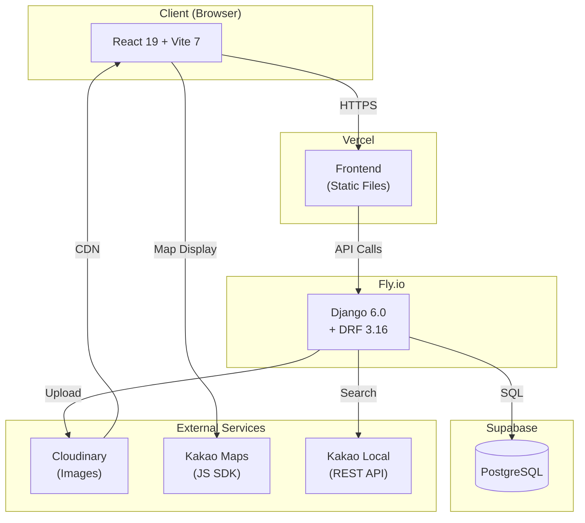

# Delicious Bingo (맛집 빙고)

맛집 탐방을 게임화한 5x5 빙고 웹 애플리케이션입니다.

**Live Demo**: https://delicious-bingo.vercel.app

---

## 핵심 기능

- **빙고 게임**: 5x5 맛집 빙고판, 목표 라인(1/3/5줄) 선택
- **리뷰 시스템**: 맛집 방문 후 리뷰 작성 → 셀 활성화
- **리더보드**: 최단 시간 클리어, 최다 완료 랭킹
- **관리자 페이지**: 식당/템플릿/카테고리/사용자 관리, 카카오 장소 검색 연동

---

## 시스템 아키텍처



## 기술 스택

| 영역 | 기술 |
|------|------|
| **Frontend** | React 19, Vite 7, Tailwind CSS 4, React Router 7, TanStack Query 5 |
| **Backend** | Django 6.0, Django REST Framework 3.16, Token Authentication |
| **Database** | PostgreSQL (Supabase) |
| **Storage** | Cloudinary (이미지) |
| **Deploy** | Vercel (Frontend), Fly.io (Backend) |

---

## 로컬 개발 환경

### Backend
```bash
cd backend
python -m venv venv
source venv/bin/activate  # Windows: venv\Scripts\activate
pip install -r requirements.txt
python manage.py migrate
python manage.py seed_data  # 샘플 데이터 생성
python manage.py runserver
```

### Frontend
```bash
cd frontend
npm install
cp .env.example .env.local  # VITE_API_URL 설정
npm run dev
```

### 테스트 계정
| 계정 | Username | Password |
|------|----------|----------|
| 일반 사용자 | `testuser` | `testpass123` |
| 관리자 | `admin` | `admin1234` |

---

## 테스트

```bash
# Backend (119 tests)
cd backend && python manage.py test

# Frontend (59 tests)
cd frontend && npm run test:run

# E2E 개발 환경 (18 tests)
cd frontend && npm run e2e

# E2E 프로덕션 (15 tests)
cd frontend && npm run e2e:prod
```

---

## 프로젝트 구조

```
delicious_bingo/
├── backend/
│   ├── api/                    # Django 앱
│   │   ├── models.py           # 데이터 모델
│   │   ├── serializers.py      # DRF Serializers
│   │   ├── views.py            # API Views
│   │   ├── views_admin.py      # Admin API Views
│   │   ├── services.py         # 빙고 라인 판정 로직
│   │   └── fixtures/           # 초기 데이터
│   ├── config/                 # Django 설정
│   ├── Dockerfile              # 프로덕션 빌드
│   └── requirements.txt
├── frontend/
│   ├── src/
│   │   ├── api/                # API 클라이언트
│   │   ├── admin/              # 관리자 페이지
│   │   ├── components/         # React 컴포넌트
│   │   ├── contexts/           # Auth Context
│   │   ├── hooks/              # Custom Hooks
│   │   ├── pages/              # 페이지 컴포넌트
│   │   └── styles/             # 브랜드 컬러, 애니메이션
│   └── package.json
├── .dockerignore               # Docker 빌드 제외 파일
├── fly.toml                    # Fly.io 배포 설정
├── CLAUDE.md                   # AI 개발 컨텍스트
├── DEPLOY.md                   # 배포 가이드
├── HISTORY.md                  # 개발 히스토리
├── PRD.md                      # 제품 요구사항
└── TROUBLESHOOTING.md          # 트러블슈팅 가이드
```

---

## 문서

| 문서 | 설명 |
|------|------|
| [PRD.md](./PRD.md) | 제품 요구사항, 데이터 모델, API 명세 |
| [DEPLOY.md](./DEPLOY.md) | Fly.io/Vercel 배포 가이드 |
| [TROUBLESHOOTING.md](./TROUBLESHOOTING.md) | 배포 트러블슈팅 |
| [HISTORY.md](./HISTORY.md) | 개발 히스토리 |
| [CLAUDE.md](./CLAUDE.md) | AI 개발 컨텍스트 |

---

## 배포

- Frontend: `git push origin master` → Vercel 자동 빌드
- Backend: `fly deploy` → Fly.io 배포

자세한 내용은 [DEPLOY.md](./DEPLOY.md) 참조.

---

## 라이선스

MIT License
